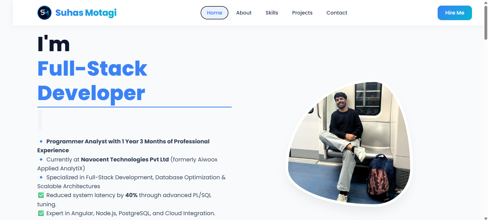
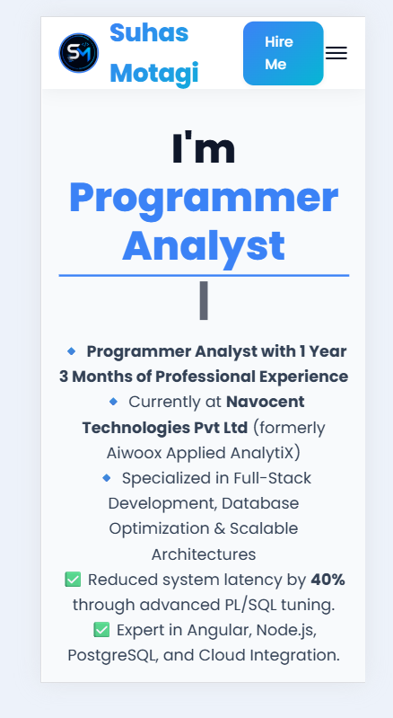
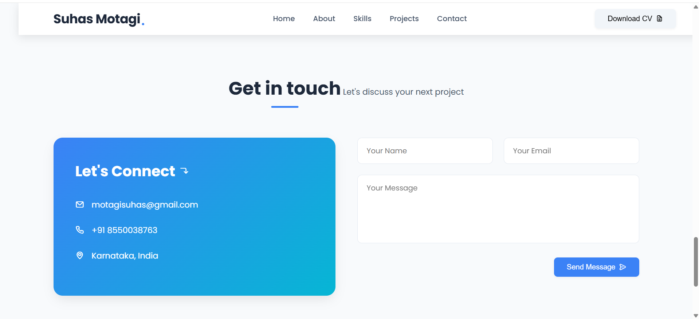

# 🚀 Suhas Motagi | Programmer Analyst

<!-- Profile Header -->
<p align="center">
  
</p>

<p align="center">
  <a href="https://suhasmotagi.dev" target="_blank">
    
  </a>
  <a href="mailto:motagisuhas@gmail.com">
    
  </a>
  <a href="https://www.linkedin.com/in/suhas-motagi-850783228" target="_blank">
    
  </a>
  <a href="https://github.com/SuhasMotagi" target="_blank">
    
  </a>
  <a href="https://wa.me/918550038763" target="_blank">
    
  </a>
</p>

---

## 📱 Portfolio Preview

### 🖥️ Desktop View


*Professional landing page with clear navigation and highlighted expertise*

### 📱 Mobile View


*Fully responsive design optimized for mobile devices*

### 📞 Contact Page


*Interactive contact form with professional contact information*

> **Note:** Make sure the images are placed in `assets/images/` folder with exact filenames as above.

---

## 🛠️ Technical Skills

### Frontend Development
<div align="left">
  
  
  
  
  
  
  
</div>

- ✅ Responsive Design • PWA • State Management (NgRx/Redux)

### Backend Development
<div align="left">
  
  
  
  
  
  
</div>

- 🔧 RESTful APIs • Microservices Architecture • API Design

### Database & Optimization
<div align="left">
  
  
  
  
  
</div>

- ⚡ Query Optimization • Database Indexing • Performance Tuning • PL/SQL Procedures

### Tools & DevOps
<div align="left">
  
  
  
  
  
  
</div>

- 🔄 Agile/Scrum • JIRA • Confluence • Firebase • Supabase • Vercel

---

## 💼 Work Experience

### **Programmer Analyst**
📅 *2025 - Present | 1+ Year Experience*

```diff
+ Key Achievements: